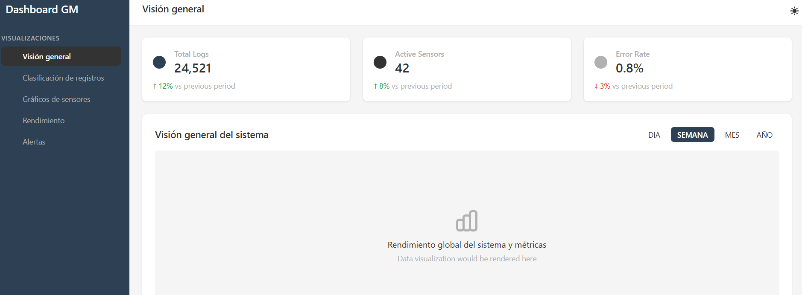

# 🚀 Dashboard de Monitoreo de GM Holding SA

## 📌 Descripción del Proyecto

Este proyecto es un **dashboard de monitoreo en tiempo real** para la empresa **GM Holding SA**, una generadora de energía ubicada en Rancagua, Chile. Su objetivo principal es proporcionar un **sistema integral de alertas y avisos** basado en los datos recopilados por los sensores de la planta, ayudando a los técnicos e ingenieros a anticipar fallas o detectarlas rápidamente, mejorando así la eficiencia operativa y reduciendo los tiempos de inactividad.

El sistema ofrece:  
✅ **Visualización de datos en tiempo real** a través de gráficos interactivos de los sensores de la planta.  
✅ **Sistema de clasificación de alertas** por niveles de criticidad (Crítico, Alerta, Aviso).  
✅ **Gestión de bitácoras** categorizadas por operarios, técnicos y administradores.  
✅ **Monitoreo del rendimiento** de equipos críticos como bombas y generadores.  
✅ **Interfaz adaptativa** con soporte para modo claro/oscuro y diseño responsive para todos los dispositivos.

---

## 🌟 Características Principales

### 📊 Panel de Control Principal
- **Estadísticas clave** con indicadores de rendimiento y comparativas con períodos anteriores
- **Visualización de alertas en tiempo real** con sistema de filtrado por nivel de criticidad
- **Registro de bitácoras** con clasificación por tipo de usuario y nivel de urgencia

### 🔔 Sistema de Alertas
- **Clasificación por niveles**: Crítico, Alerta y Aviso
- **Notificaciones visuales** con códigos de color para identificación rápida
- **Historial de alertas** con información detallada y timestamps

### 📝 Gestión de Bitácoras
- **Registro de actividades** por parte de operarios, técnicos y administradores
- **Filtrado por categorías** para facilitar la búsqueda de información
- **Asociación con alertas** para seguimiento de incidentes

### 📱 Diseño Responsive
- **Adaptación automática** a diferentes tamaños de pantalla
- **Menú lateral colapsable** para dispositivos móviles
- **Modo oscuro/claro** para mejorar la experiencia visual en diferentes entornos

---

## 🛠️ Tecnologías Utilizadas

### Frontend
- [Nuxt.js 3](https://nuxt.com/) - Framework de Vue para desarrollo web moderno con SSR y SSG
- [Vue.js 3](https://vuejs.org/) - Framework progresivo para construir interfaces de usuario
- [Tailwind CSS](https://tailwindcss.com/) - Framework de utilidades CSS para diseño rápido y responsivo
- [Chart.js](https://www.chartjs.org/) y [ApexCharts](https://apexcharts.com/) - Bibliotecas para visualización avanzada de datos
- [Vue Query](https://tanstack.com/query/latest/docs/vue/overview) - Gestión de estado del servidor y caché
- [date-fns](https://date-fns.org/) - Biblioteca para manipulación de fechas

### Herramientas de Desarrollo
- [TypeScript](https://www.typescriptlang.org/) - Superset tipado de JavaScript
- [Autoprefixer](https://github.com/postcss/autoprefixer) y [PostCSS](https://postcss.org/) - Procesamiento de CSS
- [Docker](https://www.docker.com/) - Contenedorización para despliegue consistente

---

## 🚀 Instalación y Uso

### Requisitos Previos
- Node.js (v16 o superior)
- npm o yarn

### Pasos de Instalación

```bash
# Clonar el repositorio
git clone https://github.com/tu-usuario/GM-generadora.git
cd GM-generadora

# Instalar dependencias
npm install
# o
yarn install

# Iniciar servidor de desarrollo
npm run dev
# o
yarn dev
```

### Compilación para Producción

```bash
# Construir la aplicación para producción
npm run build
# o
yarn build

# Previsualizar la versión de producción
npm run preview
# o
yarn preview
```

### Usando Docker

```bash
# Construir la imagen Docker
docker build -t gm-dashboard .

# Ejecutar el contenedor
docker run -p 3000:3000 gm-dashboard
```

---

## 📂 Estructura del Proyecto

```
/
├── assets/            # Archivos estáticos (CSS, imágenes)
├── components/        # Componentes Vue reutilizables
│   ├── Overview.vue   # Panel principal del dashboard
│   ├── Sensors.vue    # Visualización de sensores
│   ├── Logs.vue       # Gestión de bitácoras
│   └── ...            # Otros componentes
├── composables/       # Composables de Vue para lógica reutilizable
├── pages/             # Páginas de la aplicación
│   └── index.vue      # Página principal del dashboard
├── plugins/           # Plugins de Nuxt.js
├── public/            # Archivos públicos accesibles directamente
├── server/            # Código del servidor (API, middleware)
├── .nuxt/             # Archivos generados por Nuxt
├── .output/           # Salida de compilación
├── Dockerfile         # Configuración para Docker
├── nuxt.config.ts     # Configuración de Nuxt.js
├── tailwind.config.js # Configuración de Tailwind CSS
└── package.json       # Dependencias y scripts
```

---

## 📷 Capturas de Pantalla



---


