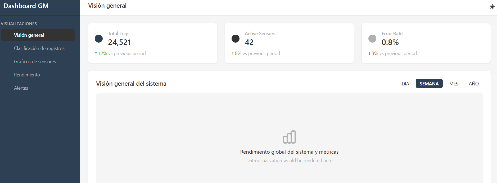

# 🚀 Dashboard de Monitoreo de GM Holding SA

## 📌 Descripción del Proyecto

Este proyecto es un **dashboard de monitoreo** para la empresa **GM Holding SA**, una generadora de energía en Rancagua. Su objetivo principal es proporcionar un **sistema de alertas y avisos** basado en los sensores de la planta, ayudando a los técnicos a anticipar fallas o detectarlas rápidamente.

El sistema muestra:  
✅ **Gráficos** en tiempo real sobre los sensores de la planta.  
✅ **Clasificación de bitácoras** de operarios, técnicos y administradores.  
✅ **Alertas y notificaciones** sobre fallas detectadas en los sensores.

---

## 🛠️ Tecnologías Usadas

- [Nuxt.js 3](https://nuxt.com/) - Framework de Vue para SSR y SSG.
- [Tailwind CSS](https://tailwindcss.com/) - Framework de CSS para estilos rápidos y responsivos.
- [Pinia](https://pinia.vuejs.org/) - Gestión de estado.
- [Chart.js](https://www.chartjs.org/) - Visualización de datos en gráficos.
- [Axios](https://axios-http.com/) - Consumo de API para obtener datos de los sensores.

---

## 📷 Captura de pantalla

