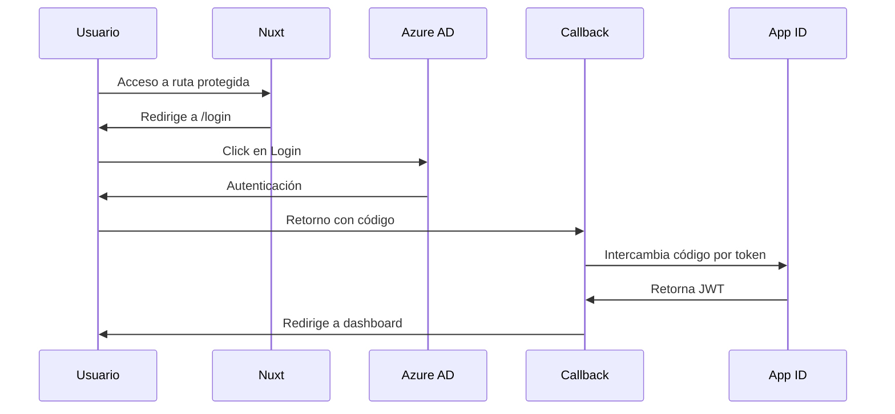

# Implementación SSO con IBM Cloud App ID y Azure AD

## Configuración Requerida
1. **Variables de entorno** (.env):
```env
IBM_APPID_CLIENT_ID=tu_client_id
IBM_APPID_CLIENT_SECRET=tu_client_secret
IBM_APPID_DISCOVERY_URL=https://us-south.appid.cloud.ibm.com/oauth/v4/{tenant-id}/.well-known/openid-configuration
```

## Implementación en Nuxt.js 3

### Plugin de Autenticación (plugins/auth.js)
```javascript
export default defineNuxtPlugin(async (nuxtApp) => {
  const { Issuer } = await import('openid-client')
  
  const issuer = await Issuer.discover(process.env.IBM_APPID_DISCOVERY_URL)
  
  const client = new issuer.Client({
    client_id: process.env.IBM_APPID_CLIENT_ID,
    client_secret: process.env.IBM_APPID_CLIENT_SECRET,
    redirect_uris: [`${window.location.origin}/callback`]
  })

  return {
    provide: {
      auth: {
        login: () => window.location.href = client.authorizationUrl({
          identity_provider: 'AzureAD',
          scope: 'openid profile'
        }),
        handleCallback: async (code) => {
          return await client.callback({
            code,
            redirect_uri: `${window.location.origin}/callback`
          })
        }
      }
    }
  }
})
```

### Página de Login (pages/login.vue)
```vue
<template>
  <div class="min-h-screen flex items-center justify-center bg-gray-100">
    <button 
      @click="$auth.login()"
      class="bg-[#0078D4] text-white px-6 py-3 rounded-lg flex items-center gap-2"
    >
      <svg class="w-5 h-5" viewBox="0 0 21 21"><path fill="#fff" d="M0 0h21v21H0z"/></svg>
      Iniciar con Azure AD
    </button>
  </div>
</template>
```

### Middleware de Seguridad (middleware/auth.ts)
```typescript
export default defineNuxtRouteMiddleware((to) => {
  const { $auth } = useNuxtApp()
  
  if (!['/login', '/callback'].includes(to.path) && !$auth?.isAuthenticated) {
    return navigateTo('/login')
  }
})
```

## Diagrama de Flujo

